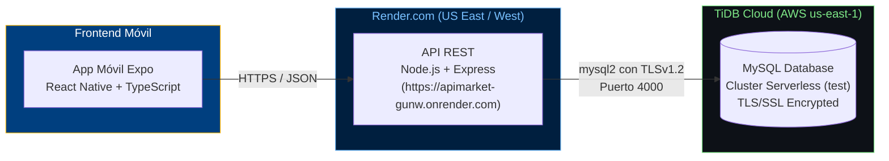

# Arquitectura y Despliegue Alternativo: Render.com + TiDB Cloud

**Materia:** Diseño y Programación de Software Multiplataforma (DPS104)  
**Guía:** Guía 11 — App Móvil con API REST: Login, Registro y CRUD  
**Estudiante:** Mateo Elías (`MatMT`)  

---

## 1. Justificación del Cambio (Alternativa a Railway)

En la guía de laboratorio original se propone el despliegue del backend y la base de datos MySQL en la plataforma **Railway**.

Sin embargo, **Railway eliminó su plan gratuito permanente** y exige una suscripción de pago mínima de **$5 USD/mes** al expirar el periodo de prueba (*trial expired*).

Para cumplir con todos los objetivos académicos de la guía, mantener la aplicación en la nube accesible públicamente para la app móvil y asegurar que la solución sea **100% gratuita y sin requerir tarjeta de crédito**, se diseñó e implementó la siguiente arquitectura cloud alternativa:

| Componente | Propuesta Original (Guía 11) | Alternativa Implementada | Motivo / Ventaja |
|---|---|---|---|
| **Servidor API** | Railway Web Service | **Render.com** (Web Service Free) | Despliegue continuo gratuito desde GitHub, soporte nativo de Node.js, HTTPS automático. |
| **Base de Datos** | Railway MySQL Service | **TiDB Cloud Serverless** | 100% compatible con MySQL 8.0, 5 GB de almacenamiento gratuito de por vida, alta disponibilidad en AWS `us-east-1`. |
| **Seguridad de Conexión** | Conexión interna no cifrada | **TLS/SSL obligatorio (`minVersion: TLSv1.2`)** | Conexión pública cifrada de extremo a extremo entre Render y TiDB Cloud. |
| **Seguridad de Cuentas** | Texto plano | **`bcryptjs` (Hashing con salt = 10)** | Almacenamiento seguro e irreversible de contraseñas. |

---

## 2. Diagrama de la Arquitectura



---

## 3. Implementación Técnica

### A. Base de Datos en TiDB Cloud
Se configuró una instancia **TiDB Serverless** en AWS (`us-east-1`). El esquema relacional ejecutado en el schema `test` fue:

```sql
USE test;

CREATE TABLE IF NOT EXISTS usuarios (
  id INT AUTO_INCREMENT PRIMARY KEY,
  nombre VARCHAR(100) NOT NULL,
  correo VARCHAR(100) NOT NULL UNIQUE,
  clave VARCHAR(255) NOT NULL
);

CREATE TABLE IF NOT EXISTS productos (
  id INT AUTO_INCREMENT PRIMARY KEY,
  nombre VARCHAR(100) NOT NULL,
  descripcion TEXT,
  precio_costo DECIMAL(10,2) NOT NULL,
  precio_venta DECIMAL(10,2) NOT NULL,
  cantidad INT NOT NULL,
  fotografia VARCHAR(255)
);

INSERT INTO productos (nombre, descripcion, precio_costo, precio_venta, cantidad, fotografia) VALUES
('Manzana verde', 'Manzana importada', 10.50, 15.00, 100,
 'https://static.vecteezy.com/system/resources/thumbnails/012/086/172/small/green-apple-with-green-leaf-isolated-on-white-background-vector.jpg');
```

### B. Adaptación de la Conexión con Soporte SSL (`src/config.js`)
Dado que TiDB Cloud exige conexiones seguras sobre endpoints públicos, se configuró el pool de conexiones de `mysql2/promise` para activar dinámicamente TLS/SSL en entornos cloud sin romper la compatibilidad con entornos locales o Railway:

```javascript
import mysql from 'mysql2/promise';
import 'dotenv/config';

export const PORT = process.env.PORT || 3000;

export const DB_HOST = process.env.MYSQLHOST || process.env.DB_HOST || 'localhost';
export const DB_PORT = process.env.MYSQLPORT || process.env.DB_PORT || 3306;
export const DB_USER = process.env.MYSQLUSER || process.env.DB_USER || 'root';
export const DB_PASSWORD = process.env.MYSQLPASSWORD || process.env.DB_PASSWORD || '';
export const DB_DATABASE = process.env.MYSQLDATABASE || process.env.DB_DATABASE || 'test';

// Detección automática: si el host no es local, activa TLS/SSL
const isCloud = DB_HOST !== 'localhost' && DB_HOST !== '127.0.0.1';

export const pool = mysql.createPool({
  host: DB_HOST,
  user: DB_USER,
  password: DB_PASSWORD,
  database: DB_DATABASE,
  port: Number(DB_PORT),
  ssl: isCloud ? { minVersion: 'TLSv1.2', rejectUnauthorized: true } : undefined,
});
```

### C. Variables de Entorno en Render.com
En el panel del Web Service en Render se configuraron las siguientes variables de entorno:

| Variable | Valor Configurado |
|---|---|
| `DB_HOST` | `gateway01.us-east-1.prod.aws.tidbcloud.com` |
| `DB_PORT` | `4000` |
| `DB_USER` | `2L6MztfaLybVUpS.root` |
| `DB_PASSWORD` | *(credencial generada en TiDB)* |
| `DB_DATABASE` | `test` |

---

## 4. Endpoints Disponibles en Producción

**URL Base:** `https://apimarket-gunw.onrender.com`

| Método | Endpoint | Descripción | Body / Parámetros |
|---|---|---|---|
| `POST` | `/usuarios/registro` | Registro de nuevo usuario (hashea contraseña con bcrypt) | `{ nombre, correo, clave }` |
| `POST` | `/usuarios/login` | Inicio de sesión seguro con verificación bcrypt | `{ correo, clave }` |
| `GET` | `/usuarios` | Consulta de usuarios registrados | N/A |
| `GET` | `/productos` | Lista de productos disponibles | N/A |
| `GET` | `/productos/:id` | Detalle de un producto por ID | `id` en URL |
| `POST` | `/productos` | Agregar nuevo producto | `{ name, description, price_cost, price_sale, quantity, image }` o nombres en español |
| `PUT` | `/productos/:id` | Actualizar información de un producto | Campos a actualizar + `id` en URL |
| `DELETE` | `/productos/:id` | Eliminar producto | `id` en URL |

---

## 5. Repositorios del Proyecto

- **API REST (Backend):** [https://github.com/MatMT/apimarket](https://github.com/MatMT/apimarket)
- **App Móvil (Expo + TypeScript):** [https://github.com/MatMT/dpsg11-market-app](https://github.com/MatMT/dpsg11-market-app)
